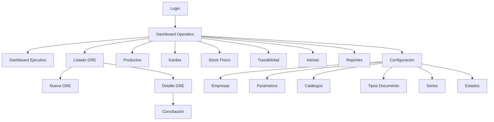

# Wireframes — GRE SMART CONTROL

> Fase 2 — Wireframes de baja fidelidad para todas las pantallas del MVP.
> La implementación visual se realiza en Fase 5 con Shadcn UI y design tokens.

---

## 1. Login

```
┌─────────────────────────────────────────────────────────────────┐
│                                                                 │
│                    ┌───────────────────────┐                    │
│                    │                       │                    │
│                    │    ◆ GRE Smart        │                    │
│                    │      Control          │                    │
│                    │                       │                    │
│                    │  Control inteligente  │                    │
│                    │  de mercadería        │                    │
│                    │                       │                    │
│                    │  ┌─────────────────┐  │                    │
│                    │  │ Email           │  │                    │
│                    │  └─────────────────┘  │                    │
│                    │  ┌─────────────────┐  │                    │
│                    │  │ Contraseña    👁 │  │                    │
│                    │  └─────────────────┘  │                    │
│                    │                       │                    │
│                    │  [    Iniciar sesión   ]                  │
│                    │                       │                    │
│                    │  ¿Olvidaste tu        │                    │
│                    │  contraseña?          │                    │
│                    │                       │                    │
│                    └───────────────────────┘                    │
│                                                                 │
│         Fondo: gradiente sutil brand-50 → neutral-50            │
└─────────────────────────────────────────────────────────────────┘
```

---

## 2. Dashboard Operativo

```
┌──────────┬──────────────────────────────────────────────────────┐
│ SIDEBAR  │ Dashboard Operativo          🔔 3  🌙  👤 Juan ▾   │
│          ├──────────────────────────────────────────────────────┤
│ ◆ GRE    │                                                      │
│          │ ┌────────┐ ┌────────┐ ┌────────┐ ┌────────┐         │
│ ⊞ Dash   │ │Total   │ │GRE     │ │GRE     │ │Diferen.│         │
│   Oper ● │ │GRE     │ │Pendien.│ │Concil. │ │Detect. │         │
│ ◫ Dash   │ │  128   │ │   12   │ │  110   │ │    8   │         │
│   Ejec   │ │ ▲ 12%  │ │        │ │        │ │ ▼ 2    │         │
│          │ └────────┘ └────────┘ └────────┘ └────────┘         │
│ ──────── │ ┌────────┐ ┌────────┐ ┌────────┐                    │
│ 📄 GRE   │ │Productos│ │Stock   │ │Alertas │                    │
│ 📦 Prod  │ │  245   │ │Disp.   │ │Activas │                    │
│ 📊 Kardex│ │        │ │ 1,840  │ │   15   │                    │
│ 📋 Stock │ └────────┘ └────────┘ └────────┘                    │
│ ⚖ Concil │                                                      │
│ 🔍 Traz  │ ┌─────────────────────────┐ ┌──────────────────┐   │
│          │ │ Movimientos (7 días)    │ │ Alertas activas  │   │
│ ──────── │ │ ┌───────────────────┐   │ │                  │   │
│ 🔔 Alert │ │ │    📊 Gráfico     │   │ │ ⚠ Dif. GRE-045  │   │
│ 📑 Repor │ │ │    de barras      │   │ │ ⚠ Stock mínimo  │   │
│          │ │ └───────────────────┘   │ │ ⚠ Dif. GRE-042  │   │
│ ──────── │ └─────────────────────────┘ │ ...              │   │
│ ⚙ Config │ ┌─────────────────────────┐ └──────────────────┘   │
│          │ │ Diferencias detectadas  │ ┌──────────────────┐   │
│          │ │ ┌───────────────────┐   │ │ Actividad reciente│  │
│          │ │ │    📊 Gráfico     │   │ │                  │   │
│          │ │ │    de líneas      │   │ │ • GRE-050 creada │   │
│          │ │ └───────────────────┘   │ │ • Concil. GRE-48 │   │
│          │ └─────────────────────────┘ │ • Prod. actualiz.│   │
│          │                              └──────────────────┘   │
│          │ ┌──────────────────────────────────────────────┐  │
│          │ │ Últimas GRE registradas                      │  │
│          │ │ Número  │ Serie │ Fecha   │ Estado  │ Acción │  │
│          │ │ GRE-050 │ T001  │ 07/07   │ ●Pend.  │  👁 ✏  │  │
│          │ │ GRE-049 │ T001  │ 06/07   │ ●Concil.│  👁    │  │
│          │ │ GRE-048 │ T001  │ 06/07   │ ●Dif.   │  👁 ✏  │  │
│          │ └──────────────────────────────────────────────┘  │
└──────────┴──────────────────────────────────────────────────────┘
```

---

## 3. Dashboard Ejecutivo

```
┌──────────┬──────────────────────────────────────────────────────┐
│ SIDEBAR  │ Dashboard Ejecutivo          🔔  🌙  👤 Juan ▾       │
│          ├──────────────────────────────────────────────────────┤
│ (igual)  │  Periodo: [Mes ▾]  [Trimestre]  [Año]              │
│          │                                                      │
│          │ ┌──────────────┐ ┌──────────────┐ ┌──────────────┐  │
│          │ │ Tasa concil. │ │ Diferencias  │ │ Tiempo prom. │  │
│          │ │    94.2%     │ │   -18% ▼     │ │   2.4 hrs    │  │
│          │ │  ▲ 3.1%      │ │  vs trimestre│ │  ▼ 0.5 hrs   │  │
│          │ └──────────────┘ └──────────────┘ └──────────────┘  │
│          │                                                      │
│          │ ┌────────────────────────────────────────────────┐   │
│          │ │ Tendencia de conciliación (6 meses)            │   │
│          │ │ ┌──────────────────────────────────────────┐   │   │
│          │ │ │         📈 Gráfico de líneas             │   │   │
│          │ │ │  Conciliadas ──  Con diferencia ──       │   │   │
│          │ │ └──────────────────────────────────────────┘   │   │
│          │ └────────────────────────────────────────────────┘   │
│          │                                                      │
│          │ ┌──────────────────────────┐ ┌───────────────────┐  │
│          │ │ Resumen por empresa      │ │ Top productos     │  │
│          │ │ Empresa A  ████████ 92%  │ │ con diferencias   │  │
│          │ │ Empresa B  ██████   78%  │ │ 1. ARROZ-001  12x │  │
│          │ │ Empresa C  █████████ 96% │ │ 2. AZUCAR-02   8x │  │
│          │ └──────────────────────────┘ │ 3. FIDEO-003   5x │  │
│          │                              └───────────────────┘  │
│          │ ┌────────────────────────────────────────────────┐  │
│          │ │ Análisis avanzado                      [Beta]   │  │
│          │ │ ┌──────────────────────────────────────────┐   │  │
│          │ │ │                                          │   │  │
│          │ │ │         📊 Power BI Embedded             │   │  │
│          │ │ │            Próximamente                   │   │  │
│          │ │ │                                          │   │  │
│          │ │ │   Análisis interactivo con dashboards    │   │  │
│          │ │ │   personalizados de Power BI             │   │  │
│          │ │ │                                          │   │  │
│          │ │ └──────────────────────────────────────────┘   │  │
│          │ └────────────────────────────────────────────────┘  │
└──────────┴──────────────────────────────────────────────────────┘
```

---

## 4. Listado de GRE

```
┌──────────┬──────────────────────────────────────────────────────┐
│ SIDEBAR  │ Guías de Remisión                [+ Nueva GRE]       │
│          ├──────────────────────────────────────────────────────┤
│          │ ┌──────────┐ ┌────────┐ ┌────────────┐ ┌─────────┐  │
│          │ │ Buscar..│ │Estado ▾│ │Desde     📅│ │Hasta  📅│  │
│          │ └──────────┘ └────────┘ └────────────┘ └─────────┘  │
│          │                                                      │
│          │ ┌────────────────────────────────────────────────┐  │
│          │ │ Número │ Serie │ Fecha  │ Transp. │ Estado│ ⚙  │  │
│          │ ├────────┼───────┼────────┼─────────┼───────┼────┤  │
│          │ │ GRE-050│ T001  │07/07/26│ Trans A │●Pend. │ 👁✏│  │
│          │ │ GRE-049│ T001  │06/07/26│ Trans B │●Concil│ 👁  │  │
│          │ │ GRE-048│ T001  │06/07/26│ Trans A │●Dif.  │ 👁✏│  │
│          │ │ GRE-047│ T001  │05/07/26│ Trans C │●Concil│ 👁  │  │
│          │ │ GRE-046│ T001  │05/07/26│ Trans A │●Anul. │ 👁  │  │
│          │ └────────────────────────────────────────────────┘  │
│          │              ◄ 1  2  3  4  5 ►   20 por página     │
└──────────┴──────────────────────────────────────────────────────┘
```

---

## 5. Formulario GRE (crear/editar)

```
┌──────────┬──────────────────────────────────────────────────────┐
│ SIDEBAR  │ Nueva Guía de Remisión                               │
│          ├──────────────────────────────────────────────────────┤
│          │                                                      │
│          │  INFORMACIÓN GENERAL                                 │
│          │  ┌────────────┐ ┌────────┐ ┌────────────────────┐   │
│          │  │ Número GRE │ │ Serie ▾│ │ Fecha            📅│   │
│          │  └────────────┘ └────────┘ └────────────────────┘   │
│          │  ┌────────────┐ ┌────────────────────────────────┐   │
│          │  │ RUC        │ │ Empresa                        │   │
│          │  └────────────┘ └────────────────────────────────┘   │
│          │  ┌────────────────────┐ ┌──────────────────────┐   │
│          │  │ Transportista      │ │ Origen               │   │
│          │  └────────────────────┘ └──────────────────────┘   │
│          │  ┌──────────────────────────────────────────────┐  │
│          │  │ Destino                                      │  │
│          │  └──────────────────────────────────────────────┘  │
│          │                                                      │
│          │  PRODUCTOS                          [+ Agregar]    │
│          │  ┌────────────────────────────────────────────────┐  │
│          │  │ Código    │ Producto      │ Cantidad │  ✕     │  │
│          │  ├───────────┼───────────────┼──────────┼────────┤  │
│          │  │ ARROZ-001 │ Arroz Premium │  100     │  🗑    │  │
│          │  │ AZUCAR-02 │ Azúcar Rubia  │   50     │  🗑    │  │
│          │  └────────────────────────────────────────────────┘  │
│          │                                                      │
│          │  ARCHIVOS ADJUNTOS                                   │
│          │  ┌────────────────────────────────────────────────┐  │
│          │  │  📎 Arrastra XML o PDF aquí, o haz clic       │  │
│          │  │     Formatos: .xml, .pdf · Máx: 10 MB          │  │
│          │  └────────────────────────────────────────────────┘  │
│          │  📄 guia_050.xml (24 KB)  ✕                          │
│          │                                                      │
│          │              [Cancelar]  [Guardar GRE]               │
└──────────┴──────────────────────────────────────────────────────┘
```

---

## 6. Detalle GRE

```
┌──────────┬──────────────────────────────────────────────────────┐
│ SIDEBAR  │ GRE-050 · T001            ● Pendiente    [Editar]    │
│          ├──────────────────────────────────────────────────────┤
│          │ [Información] [Productos] [Archivos] [Trazabilidad]  │
│          │                                                      │
│          │  Fecha: 07/07/2026        Transportista: Trans A     │
│          │  RUC: 20123456789         Empresa: Distribuidora XYZ  │
│          │  Origen: Av. Industrial 123                        │
│          │  Destino: Jr. Comercio 456                         │
│          │                                                      │
│          │  PRODUCTOS                                           │
│          │  ┌────────────────────────────────────────────────┐  │
│          │  │ Código    │ Producto      │ Cantidad          │  │
│          │  ├───────────┼───────────────┼───────────────────┤  │
│          │  │ ARROZ-001 │ Arroz Premium │ 100 UND           │  │
│          │  │ AZUCAR-02 │ Azúcar Rubia  │  50 UND           │  │
│          │  └────────────────────────────────────────────────┘  │
│          │                                                      │
│          │  CONCILIACIÓN                                       │
│          │  ┌────────────────────────────────────────────────┐  │
│          │  │ Producto   │ GRE │ Kardex │ Físico │ Estado  │  │
│          │  ├────────────┼─────┼────────┼────────┼─────────┤  │
│          │  │ ARROZ-001  │ 100 │   98   │   95   │ ⚠ Dif. │  │
│          │  │ AZUCAR-02  │  50 │   50   │   50   │ ✓ OK   │  │
│          │  └────────────────────────────────────────────────┘  │
│          │                              [Ejecutar conciliación]   │
└──────────┴──────────────────────────────────────────────────────┘
```

---

## 7. Productos

```
┌──────────┬──────────────────────────────────────────────────────┐
│ SIDEBAR  │ Productos                       [+ Nuevo Producto]   │
│          ├──────────────────────────────────────────────────────┤
│          │ ┌──────────┐ ┌────────────┐                          │
│          │ │ Buscar.. │ │ Categoría ▾│                          │
│          │ └──────────┘ └────────────┘                          │
│          │                                                      │
│          │ ┌────────────────────────────────────────────────┐   │
│          │ │ Código   │ Nombre       │ Cat.  │ Kardex│Mín│⚙ │   │
│          │ ├──────────┼──────────────┼───────┼───────┼───┼──┤   │
│          │ │ARROZ-001 │Arroz Premium │Granos │  98   │10 │👁✏│   │
│          │ │AZUCAR-02 │Azúcar Rubia  │Granos │  50   │ 5 │👁✏│   │
│          │ │FIDEO-003 │Fideo Spaghetti│Granos │   3⚠│ 5 │👁✏│   │
│          │ └────────────────────────────────────────────────┘   │
│          │              ◄ 1  2  3 ►                           │
└──────────┴──────────────────────────────────────────────────────┘
```

---

## 8. Kardex

```
┌──────────┬──────────────────────────────────────────────────────┐
│ SIDEBAR  │ Kardex                          [+ Nuevo Movimiento] │
│          ├──────────────────────────────────────────────────────┤
│          │ ┌──────────┐ ┌────────┐ ┌────────┐ ┌─────────────┐  │
│          │ │Producto ▾│ │Tipo  ▾ │ │Desde 📅│ │ Hasta     📅│  │
│          │ └──────────┘ └────────┘ └────────┘ └─────────────┘  │
│          │                                                      │
│          │ ┌────────────────────────────────────────────────┐  │
│          │ │ Fecha  │ Producto  │ Tipo    │ Cant.│ Stock │Ref│  │
│          │ ├────────┼───────────┼─────────┼──────┼───────┼───┤  │
│          │ │07/07 26│ARROZ-001  │● Salida │ -100 │  98   │GRE│  │
│          │ │06/07 26│AZUCAR-02  │● Entrada│  +50 │  50   │OC │  │
│          │ │05/07 26│ARROZ-001  │● Entrada│ +200 │ 198   │OC │  │
│          │ │04/07 26│FIDEO-003  │● Ajuste │   -2 │   3   │INV│  │
│          │ └────────────────────────────────────────────────┘  │
└──────────┴──────────────────────────────────────────────────────┘
```

---

## 9. Stock Físico

```
┌──────────┬──────────────────────────────────────────────────────┐
│ SIDEBAR  │ Stock Físico                    [+ Registrar Conteo] │
│          ├──────────────────────────────────────────────────────┤
│          │ ┌──────────┐ ┌────────────┐                          │
│          │ │Producto ▾│ │ Ubicación ▾│                          │
│          │ └──────────┘ └────────────┘                          │
│          │                                                      │
│          │ ┌────────────────────────────────────────────────┐  │
│          │ │ Fecha   │ Producto  │ Cantidad│ Ubic. │ Kardex│  │
│          │ ├─────────┼───────────┼─────────┼───────┼───────┤  │
│          │ │07/07/26 │ARROZ-001  │   95    │Alm-A  │  98 ⚠│  │
│          │ │07/07/26 │AZUCAR-02  │   50    │Alm-A  │  50 ✓│  │
│          │ │06/07/26 │FIDEO-003  │    3    │Alm-B  │   3 ✓│  │
│          │ └────────────────────────────────────────────────┘  │
│          │                                                      │
│          │  Comparación: Stock Físico vs Kardex                 │
│          │  ⚠ = diferencia detectada   ✓ = coincide             │
└──────────┴──────────────────────────────────────────────────────┘
```

---

## 10. Conciliación

```
┌──────────┬──────────────────────────────────────────────────────┐
│ SIDEBAR  │ Conciliación                                         │
│          ├──────────────────────────────────────────────────────┤
│          │                                                      │
│          │  RESUMEN                                             │
│          │  ┌────────┐ ┌────────┐ ┌────────┐ ┌────────┐       │
│          │  │Pendien.│ │Revisad.│ │Resuelt.│ │Total   │       │
│          │  │   8    │ │   3    │ │  12    │ │  23    │       │
│          │  └────────┘ └────────┘ └────────┘ └────────┘       │
│          │                                                      │
│          │  INCIDENCIAS PENDIENTES                              │
│          │  ┌────────────────────────────────────────────────┐  │
│          │  │ GRE    │ Producto │ Tipo       │ Dif. │Estado │  │
│          │  ├────────┼──────────┼────────────┼──────┼───────┤  │
│          │  │GRE-050 │ARROZ-001 │GRE-Físico  │  +5  │●Pend. │  │
│          │  │GRE-050 │ARROZ-001 │GRE-Kardex  │  +2  │●Pend. │  │
│          │  │GRE-048 │FIDEO-003 │Kardex-Fís. │  +0  │●Revis.│  │
│          │  └────────────────────────────────────────────────┘  │
│          │                                                      │
│          │  COMPARACIÓN TRIPLE (detalle expandido)              │
│          │  ┌────────────────────────────────────────────────┐  │
│          │  │         GRE ──── Kardex ──── Físico           │  │
│          │  │ ARROZ-001                                       │  │
│          │  │  100  ──────────  98  ──────────  95            │  │
│          │  │       ▲+2              ▲+3                      │  │
│          │  └────────────────────────────────────────────────┘  │
└──────────┴──────────────────────────────────────────────────────┘
```

---

## 11. Trazabilidad

```
┌──────────┬──────────────────────────────────────────────────────┐
│ SIDEBAR  │ Trazabilidad                                         │
│          ├──────────────────────────────────────────────────────┤
│          │                                                      │
│          │  ┌──────────────────────────────────────────────┐    │
│          │  │ Buscar por producto, GRE o código...         │    │
│          │  └──────────────────────────────────────────────┘    │
│          │                                                      │
│          │  TIMELINE — ARROZ-001 (GRE-050)                     │
│          │                                                      │
│          │  ● 07/07/2026 09:30  GRE Emitida                    │
│          │  │  GRE-050 registrada con 100 unidades              │
│          │  │                                                    │
│          │  ● 07/07/2026 09:35  Archivo XML cargado              │
│          │  │  guia_remision_050.xml (24 KB)                      │
│          │  │                                                    │
│          │  ● 07/07/2026 10:00  Movimiento Kardex                │
│          │  │  Salida: -100 unidades (Ref: GRE-050)               │
│          │  │  Stock kardex: 198 → 98                           │
│          │  │                                                    │
│          │  ● 07/07/2026 14:00  Stock Físico registrado          │
│          │  │  Conteo: 95 unidades (Almacén A)                   │
│          │  │                                                    │
│          │  ● 07/07/2026 14:05  Conciliación iniciada            │
│          │  │                                                    │
│          │  ◆ 07/07/2026 14:05  Conciliación con diferencia     │
│          │  │  ⚠ GRE(100) vs Kardex(98): +2                      │
│          │  │  ⚠ GRE(100) vs Físico(95): +5                      │
│          │  │  ⚠ Kardex(98) vs Físico(95): +3                    │
│          │  │                                                    │
│          │  ○ 07/07/2026 14:05  Incidencia creada                │
│          │     Estado: Pendiente de revisión                     │
│          │                                                      │
└──────────┴──────────────────────────────────────────────────────┘
```

---

## 12. Alertas

```
┌──────────┬──────────────────────────────────────────────────────┐
│ SIDEBAR  │ Alertas                          [Marcar todas leídas]│
│          ├──────────────────────────────────────────────────────┤
│          │ [Todas] [Diferencias] [Stock mínimo] [Stock insuf.]  │
│          │                                                      │
│          │ ┌────────────────────────────────────────────────┐   │
│          │ │ ▌⚠ Diferencia GRE vs Stock Físico      hace 2h│   │
│          │ │ ▌  ARROZ-001: GRE declara 100, físico tiene 95│   │
│          │ │ ▌  [Ver incidencia]  [Marcar leída]            │   │
│          │ └────────────────────────────────────────────────┘   │
│          │ ┌────────────────────────────────────────────────┐   │
│          │ │ ▌⚠ Stock mínimo alcanzado              hace 5h│   │
│          │ │ ▌  FIDEO-003: stock kardex 3, mínimo 5        │   │
│          │ │ ▌  [Ver producto]  [Marcar leída]              │   │
│          │ └────────────────────────────────────────────────┘   │
│          │ ┌────────────────────────────────────────────────┐   │
│          │ │ ▌ℹ Diferencia GRE vs Kardex           hace 1d│   │
│          │ │ ▌  AZUCAR-02: GRE declara 50, kardex tiene 48 │   │
│          │ │ ▌  [Ver incidencia]  [Marcar leída]            │   │
│          │ └────────────────────────────────────────────────┘   │
└──────────┴──────────────────────────────────────────────────────┘
```

---

## 13. Configuración

```
┌──────────┬──────────────────────────────────────────────────────┐
│ SIDEBAR  │ Configuración                                        │
│          ├──────────────────────────────────────────────────────┤
│          │ ┌────────────┐ ┌──────────────────────────────────┐  │
│          │ │            │ │                                  │  │
│          │ │ Empresas ● │ │  EMPRESAS          [+ Nueva]    │  │
│          │ │ Parámetros │ │                                  │  │
│          │ │ Catálogos  │ │  ┌──────────────────────────┐   │  │
│          │ │ Tipos doc. │ │  │ RUC       │ Razón Social  │⚙ │  │
│          │ │ Series     │ │  ├───────────┼───────────────┼──┤  │
│          │ │ Estados    │ │  │20123456789│Distribuidora X│👁✏│  │
│          │ │            │ │  │20987654321│Almacenes Y    │👁✏│  │
│          │ │            │ │  └──────────────────────────┘   │  │
│          │ │            │ │                                  │  │
│          │ └────────────┘ └──────────────────────────────────┘  │
└──────────┴──────────────────────────────────────────────────────┘
```

---

## 14. Reportes

```
┌──────────┬──────────────────────────────────────────────────────┐
│ SIDEBAR  │ Reportes                                             │
│          ├──────────────────────────────────────────────────────┤
│          │                                                      │
│          │  ┌────────────┐ ┌────────────┐ ┌────────────┐       │
│          │  │ Tipo     ▾ │ │ Desde    📅│ │ Hasta    📅│       │
│          │  └────────────┘ └────────────┘ └────────────┘       │
│          │                                                      │
│          │  ┌──────────────────┐  ┌──────────────────┐         │
│          │  │ 📊 Reporte GRE   │  │ 📊 Reporte       │         │
│          │  │                  │  │    Productos     │         │
│          │  │ Listado de GRE   │  │                  │         │
│          │  │ con estados de   │  │ Inventario con   │         │
│          │  │ conciliación     │  │ stock kardex y   │         │
│          │  │                  │  │ físico           │         │
│          │  │ [Excel] [PDF]    │  │ [Excel] [PDF]    │         │
│          │  └──────────────────┘  └──────────────────┘         │
│          │                                                      │
│          │  ┌──────────────────┐  ┌──────────────────┐         │
│          │  │ 📊 Reporte       │  │ 📊 Resumen       │         │
│          │  │    Kardex        │  │    Ejecutivo     │         │
│          │  │                  │  │                  │         │
│          │  │ Movimientos por  │  │ KPIs, diferencias│         │
│          │  │ producto y fecha │  │ y conciliación   │         │
│          │  │                  │  │                  │         │
│          │  │ [Excel] [PDF]    │  │ [Excel] [PDF]    │         │
│          │  └──────────────────┘  └──────────────────┘         │
└──────────┴──────────────────────────────────────────────────────┘
```

---

## 15. Flujo de navegación



---

## 16. Permisos por rol

| Pantalla | Admin | Supervisor | Consulta |
|----------|-------|------------|----------|
| Dashboard Operativo | Lectura + acciones | Lectura + acciones | Solo lectura |
| Dashboard Ejecutivo | Lectura + Power BI | Lectura | Solo lectura |
| GRE (CRUD) | Completo | Crear/Editar | Solo lectura |
| Productos (CRUD) | Completo | Crear/Editar | Solo lectura |
| Kardex | Completo | Crear movimientos | Solo lectura |
| Stock Físico | Completo | Registrar conteos | Solo lectura |
| Conciliación | Ejecutar + resolver | Ejecutar + resolver | Solo lectura |
| Trazabilidad | Completo | Completo | Solo lectura |
| Alertas | Gestionar | Marcar leídas | Solo lectura |
| Reportes | Exportar | Exportar | Exportar |
| Configuración | Completo | Sin acceso | Sin acceso |
