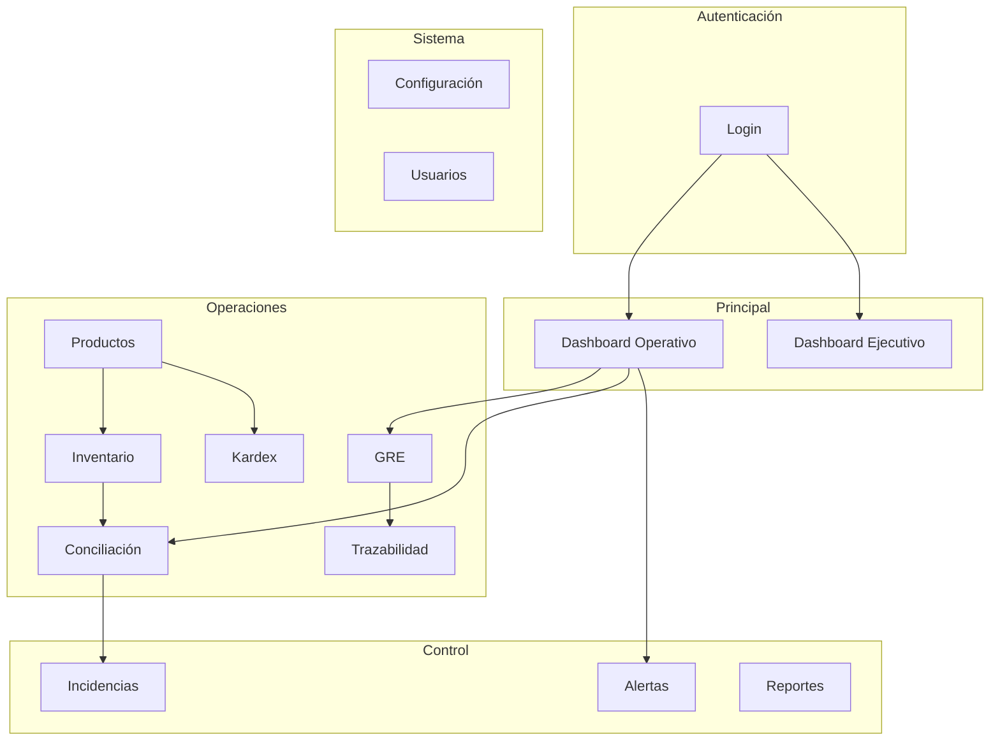

# Wireframes — GRE SMART CONTROL
## Fase 2 — Baja fidelidad con anotaciones UX

> Wireframes actualizados con todos los módulos del MVP.
> Prototipo navegable de alta fidelidad: `design/prototype/`

---

## Mapa de navegación



---

## 1. Login

```
┌─────────────────────────────────────────────────────────────────────────┐
│                                                                         │
│  ┌──────────────────────────┐  ┌──────────────────────────────────┐  │
│  │                          │  │                                  │  │
│  │  ┌──────┐                │  │                                  │  │
│  │  │ ◆◆◆  │                │  │     [Ilustración empresarial]    │  │
│  │  │ ◆◆◆  │                │  │                                  │  │
│  │  └──────┘                │  │     Cadena de suministro         │  │
│  │                          │  │     conectada digitalmente       │  │
│  │  GRE SMART CONTROL       │  │                                  │  │
│  │                          │  │     GRE → Almacén → Control      │  │
│  │  Control Inteligente     │  │                                  │  │
│  │  para la Trazabilidad    │  │                                  │  │
│  │  y Cumplimiento          │  │                                  │  │
│  │  Tributario              │  │                                  │  │
│  │                          │  │                                  │  │
│  │  ┌────────────────────┐  │  │                                  │  │
│  │  │ Correo electrónico │  │  │                                  │  │
│  │  └────────────────────┘  │  │                                  │  │
│  │  ┌────────────────────┐  │  │                                  │  │
│  │  │ Contraseña       👁 │  │  │                                  │  │
│  │  └────────────────────┘  │  │                                  │  │
│  │                          │  │                                  │  │
│  │  ☐ Recordarme            │  │                                  │  │
│  │                          │  │                                  │  │
│  │  [    Iniciar sesión    ]│  │                                  │  │
│  │                          │  │                                  │  │
│  │  ¿Olvidaste tu           │  │                                  │  │
│  │  contraseña?             │  │                                  │  │
│  │                          │  │                                  │  │
│  └──────────────────────────┘  └──────────────────────────────────┘  │
│         40% ancho                       60% ancho                       │
│         Fondo: white card               Gradiente: brand-50 → brand-100 │
└─────────────────────────────────────────────────────────────────────────┘
```

**UX:** Split layout enterprise. Animación fade-in del card al cargar.

---

## 2. Dashboard Ejecutivo

```
┌─────────┬───────────────────────────────────────────────────────────────┐
│ SIDEBAR │ Dashboard Ejecutivo    [Mes▾] [Trimestre] [Año]  🔔 🌙 👤   │
│         ├───────────────────────────────────────────────────────────────┤
│         │                                                               │
│         │ ┌─────────┐ ┌─────────┐ ┌─────────┐ ┌─────────┐ ┌────────┐  │
│         │ │Riesgo   │ │GRE      │ │GRE      │ │GRE      │ │Product.│  │
│         │ │Tributar.│ │Emitidas │ │Pendien. │ │Concil.  │ │        │  │
│         │ │  32%    │ │  128    │ │   12    │ │  110    │ │  245   │  │
│         │ │MODERADO │ │ ▲12%    │ │         │ │ ▲8%     │ │        │  │
│         │ └─────────┘ └─────────┘ └─────────┘ └─────────┘ └────────┘  │
│         │ ┌─────────┐ ┌─────────┐                                    │
│         │ │Alertas  │ │Inciden. │                                    │
│         │ │   15    │ │    8    │                                    │
│         │ └─────────┘ └─────────┘                                    │
│         │                                                               │
│         │ ┌──────────────────────────────┐ ┌──────────────────────┐   │
│         │ │ Tendencia Conciliación (6m)  │ │ Stock por Categoría  │   │
│         │ │ [══════ Line Chart ══════]   │ │ [═══ Donut ═══]      │   │
│         │ └──────────────────────────────┘ └──────────────────────┘   │
│         │                                                               │
│         │ ┌──────────────────────────────┐ ┌──────────────────────┐   │
│         │ │ Diferencias por Mes          │ │ Actividad Reciente   │   │
│         │ │ [══════ Area Chart ══════]   │ │ • GRE-050 creada     │   │
│         │ └──────────────────────────────┘ │ • Conciliación GRE-48│   │
│         │                                   │ • Alerta stock mín.  │   │
│         │ ┌─────────────────────────────────┴──────────────────────┘   │
│         │ │ Power BI Embedded                    [Próximamente]       │   │
│         │ │ ┌─────────────────────────────────────────────────────┐  │   │
│         │ │ │              📊 Análisis avanzado                   │  │   │
│         │ │ │         Dashboards interactivos de Power BI       │  │   │
│         │ │ └─────────────────────────────────────────────────────┘  │   │
│         │ └────────────────────────────────────────────────────────┘   │
│         ├───────────────────────────────────────────────────────────────┤
│         │ GRE Smart Control v0.1.0 · © 2026                              │
└─────────┴───────────────────────────────────────────────────────────────┘
```

**UX:** Mejor pantalla del sistema. Riesgo Tributario como KPI #1.

---

## 3. Dashboard Operativo

```
┌─────────┬───────────────────────────────────────────────────────────────┐
│ SIDEBAR │ Dashboard Operativo                          🔔3  🌙  👤     │
│         ├───────────────────────────────────────────────────────────────┤
│         │ ┌────────┐ ┌────────┐ ┌────────┐ ┌────────┐                  │
│         │ │GRE Hoy │ │Pendien.│ │Diferen.│ │Stock   │                  │
│         │ │   5    │ │   12   │ │    8   │ │ 1,840  │                  │
│         │ └────────┘ └────────┘ └────────┘ └────────┘                  │
│         │                                                               │
│         │ ┌─────────────────────────┐ ┌──────────────────────────┐    │
│         │ │ Movimientos (7 días)    │ │ ⚠ Alertas Activas (5)   │    │
│         │ │ [═══ Bar Chart ═══]     │ │ ▌Dif. GRE-050 ARROZ-001 │    │
│         │ └─────────────────────────┘ │ ▌Stock mín. FIDEO-003    │    │
│         │ ┌─────────────────────────┐ │ ▌Dif. GRE-048 AZUCAR-02  │    │
│         │ │ Diferencias detectadas  │ └──────────────────────────┘    │
│         │ │ [═══ Line Chart ═══]    │ ┌──────────────────────────┐    │
│         │ └─────────────────────────┘ │ Actividad Reciente       │    │
│         │                              │ • GRE-050 registrada     │    │
│         │ ┌──────────────────────────────────────────────────────┐    │
│         │ │ Últimas GRE                                          │    │
│         │ │ GRE-050 │ T001 │ 07/07 │ ●Pend.  │ GRE-049 │ ●Conc.│    │
│         │ └──────────────────────────────────────────────────────┘    │
│         │ ┌──────────────────────────────────────────────────────┐    │
│         │ │ Productos Críticos (stock < mínimo)                    │    │
│         │ │ FIDEO-003 │ Stock: 3 │ Mínimo: 5 │ ⚠                  │    │
│         │ └──────────────────────────────────────────────────────┘    │
└─────────┴───────────────────────────────────────────────────────────────┘
```

---

## 4–15. Demás pantallas

Las pantallas restantes (GRE, Productos, Inventario, Kardex, Stock Físico, Conciliación, Trazabilidad, Alertas, Incidencias, Reportes, Configuración, Usuarios) siguen la misma estructura de layout documentada en `03-GUIA-COMPONENTES.md` y están implementadas como **mockups de alta fidelidad** en el prototipo navegable.

---

## Permisos por rol

| Pantalla | Admin | Supervisor | Consulta |
|----------|:-----:|:----------:|:--------:|
| Dashboard Ejecutivo | ✓ | ✓ | ✓ (lectura) |
| Dashboard Operativo | ✓ | ✓ | ✓ (lectura) |
| GRE | CRUD | Crear/Editar | Lectura |
| Productos | CRUD | Crear/Editar | Lectura |
| Inventario | ✓ | ✓ | Lectura |
| Kardex | CRUD | Crear | Lectura |
| Stock Físico | CRUD | Crear | Lectura |
| Conciliación | Ejecutar | Ejecutar | Lectura |
| Trazabilidad | ✓ | ✓ | ✓ |
| Alertas | Gestionar | Marcar leídas | Lectura |
| Incidencias | Resolver | Resolver | Lectura |
| Reportes | Exportar | Exportar | Exportar |
| Configuración | ✓ | ✗ | ✗ |
| Usuarios | ✓ | ✗ | ✗ |

---

## Responsive

| Elemento | Desktop | Tablet | Mobile |
|----------|---------|--------|--------|
| Sidebar | 260px fijo | 68px iconos | Drawer overlay |
| KPI row | 4-7 cols | 2 cols | 1 col stack |
| Charts | 2/3 + 1/3 | Stack | Stack |
| Tablas | Full table | Full table | Card list |
| Conciliación triple | 3 cols | 3 cols compact | Stack vertical |
| Filter bar | 1 row | 2 rows | Stack |

Ver prototipo navegable para validar responsive en `design/prototype/`.
